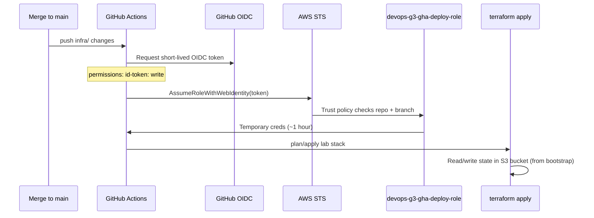

# Bootstrap vs Lab — How Terraform and CI/CD Fit Together

This repo has **two separate Terraform projects**. They run independently and solve different problems. Confusing them is the main reason bootstrap feels mysterious.

---

## The two Terraform stacks

| | **Bootstrap** (`infra/bootstrap/`) | **Lab workload** (`infra/environments/lab/`) |
|---|---|---|
| **Purpose** | Account-level plumbing CI needs | The actual app infrastructure (VPC, ECS, ALB, alarms…) |
| **Applied by** | A human, manually, rarely | GitHub Actions on every merge to `main` (and locally) |
| **State file** | Local or its own backend (not the shared bucket) | S3 bucket `devops-g3-tfstate-240462142849-uswest1` |
| **Creates** | S3 state bucket, **GitHub Actions deploy IAM role** | ECS services, ALB, observability, etc. |
| **How often** | Once per AWS account (or when permissions change) | Every infra change |

Think of it like building a house:

- **Bootstrap** = pouring the foundation and installing the electric meter (once).
- **Lab stack** = walls, plumbing, furniture (changes often).
- CI/CD can't deploy the house until the foundation and meter exist.

---

## What bootstrap actually creates

```
infra/bootstrap/
├── S3 bucket          → stores lab Terraform state remotely
├── IAM role           → devops-g3-gha-deploy-role
└── IAM policy on role → what that role is allowed to do in AWS
```

The **IAM role** is the piece GitHub Actions uses. Bootstrap does **not** deploy your containers or alarms — it only creates the **permission** for automation to do that.

---

## How GitHub Actions gets AWS credentials (no stored keys)

There are **no** `AWS_ACCESS_KEY_ID` secrets in the repo for Terraform deploy.



### Trust policy (who may assume the role)

From `infra/bootstrap/main.tf` — only this exact ref may assume the role:

```
repo:hunterachieng/group-3-devops-networking:ref:refs/heads/main
```

Forks, other branches, and random repos **cannot** get these credentials.

### Workflow split

| Job | Needs AWS? | What it does |
|---|---|---|
| `fmt / validate / test` | **No** | Syntax checks + mock tests on every PR |
| `terraform apply (lab)` | **Yes** | Real deploy; runs only on `main` push |

See `.github/workflows/terraform.yml` lines 47–102.

---

## Why we had to touch bootstrap for Chatbot / alarms

The lab stack **creates** CloudWatch alarms, SNS topics, and AWS Chatbot.

The GHA deploy role **permission list** lives in bootstrap. If lab Terraform needs a new AWS API (e.g. `sns:CreateTopic`, `chatbot:CreateSlackChannelConfiguration`) but bootstrap wasn't updated, CI fails with `AccessDenied` even though the Terraform code is correct.

**Rule:** New AWS services in the lab stack → add permissions to `infra/bootstrap/main.tf` → apply bootstrap **once manually** → then lab CI works.

---

## Apply order (first time or after bootstrap changes)

### 1. Bootstrap (manual, from your laptop)

```bash
cd infra/bootstrap
terraform init
terraform plan
terraform apply
```

Uses **your** AWS credentials (`aws configure` / SSO). Creates the state bucket and GHA role.

### 2. Lab stack (CI or local)

```bash
cd infra/environments/lab
terraform init    # connects to S3 backend from bootstrap
terraform apply
```

On `main`, GitHub Actions does step 2 automatically using the role from step 1.

---

## Slack / AWS Chatbot setup (one-time + CI)

Chatbot is created by the **lab** observability module, not bootstrap.

### Step A — Authorize Slack in AWS (console, once)

1. AWS Console → **AWS Chatbot**
2. **Configure new client** → **Slack** → **Configure**
3. Allow access to your workspace
4. Pick channel `#group-3-alerts` (or create it)

### Step B — Get Slack IDs

| ID | How to find |
|---|---|
| **Team ID** (`T…`) | AWS Chatbot console shows it after auth, or Slack workspace settings |
| **Channel ID** (`C…`) | Slack → channel → ⋮ → **Copy link** → `.../archives/C0123456789` |

### Step C — Store Slack webhook in GitHub (CI configures Lambda on deploy)

Repo → **Settings** → **Secrets and variables** → **Actions** → **Variables** → **New repository variable**:

| Variable name | Example | Purpose |
|---|---|---|
| `SLACK_WEBHOOK_URL` | `https://hooks.slack.com/services/T.../B.../...` | Incoming Webhook for `#group-3-alerts` |
| `ALERT_EMAIL` | `team@example.com` | Optional email alongside Slack |

The deploy job maps `SLACK_WEBHOOK_URL` → `TF_VAR_slack_webhook_url`. Terraform creates a Lambda subscribed to the SNS topic — **no AWS Chatbot console OAuth required**.

On merge to `main`, CI runs `terraform apply` with that value.

After deploy:

```bash
terraform output production_readiness_slack_lambda_enabled   # → true
```

**Optional (AWS Chatbot):** If your SSO role allows `chatbot:GetSlackOauthParameters`, you can instead set `SLACK_TEAM_ID` + `SLACK_CHANNEL_ID`. Most cohort roles cannot — use the webhook path above.

**Local apply:**

```bash
export TF_VAR_slack_webhook_url='https://hooks.slack.com/services/...'
terraform apply
```

---

## Local apply vs CI apply

| | **Your laptop** | **GitHub Actions** |
|---|---|---|
| Credentials | `aws login` / exported creds | OIDC → `devops-g3-gha-deploy-role` |
| Can run bootstrap? | Yes | No (not in workflow) |
| Can run lab stack? | Yes | Yes (on main only) |
| Slack Chatbot IDs | `export TF_VAR_slack_*` or terraform.tfvars | Repo **Variables** `SLACK_TEAM_ID`, `SLACK_CHANNEL_ID` |

CI reads repository variables and sets `TF_VAR_slack_team_id` / `TF_VAR_slack_channel_id` automatically in the deploy job — see `.github/workflows/terraform.yml`.

---

## Quick FAQ

**Q: Is bootstrap the same as "bootstrapping the cluster"?**  
No. Bootstrap here means **bootstrapping CI/CD access** — state storage + IAM for GitHub.

**Q: Why isn't bootstrap in the same S3 backend?**  
Chicken and egg: the bucket must exist before other stacks can use it as a backend. Bootstrap typically uses local state or a minimal separate backend.

**Q: I merged observability code but CI failed with AccessDenied on SNS/Chatbot.**  
Apply the updated bootstrap stack manually first (see § "Apply order").

**Q: Do alerts still work without Slack IDs?**  
Yes. SNS topic + optional email still work; Chatbot resources are skipped when `slack_team_id` or `slack_channel_id` is empty.

---

## File map

| File | Role |
|---|---|
| `infra/bootstrap/main.tf` | State bucket + GHA IAM role/policy |
| `infra/environments/lab/backend.tf` | Points lab state at bootstrap bucket |
| `.github/workflows/terraform.yml` | CI: validate (no creds) + apply on main (OIDC) |
| `infra/modules/observability/chatbot.tf` | SNS → Slack via Chatbot |
