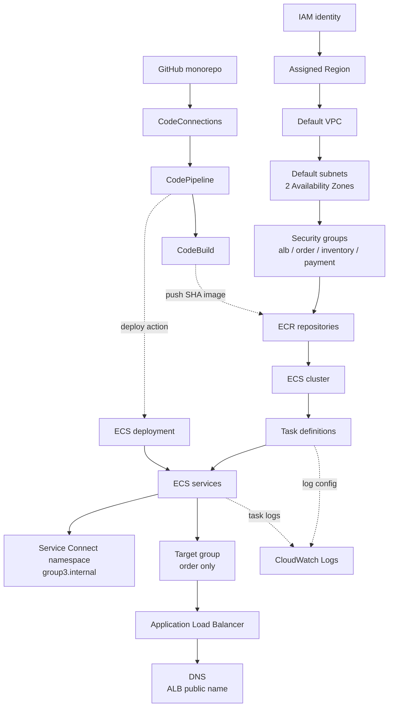

# Gate 1 Submission — Draw the Graph

**Group:** group-3
**Repo:** github.com/hunterachieng/group-3-devops-networking
**Phase:** 1 (paper gate; no AWS resources created)

We use domain service names (order, inventory, payment) rather than the abstract
a/b/c from the scenario. This matches our existing Compose discovery
(`http://inventory:3002`) and carries straight over to Service Connect.

| Scenario role | Our service | App port | Public? |
|---|---|---|---|
| Service A | order | 3001 | via ALB only |
| Service B | inventory | 3002 | no |
| Service C | payment | 3003 | no |

> Note: Phase 3.1 lists "service-a/b/c" as required Service Connect names. We read
> that as the generic scenario template and instantiate it with domain names. If
> the grader is literal about those strings, confirm before Gate 2.

---

## Design decision recorded: the payment -> order callback (C -> A)

Our design keeps payment (C) calling order (A) on `/confirm` after a successful
charge. The assignment's contract permits only `Internet -> ALB -> A -> B -> C`
and states no other path should be permitted, so this is a **deliberate,
documented deviation**, not an oversight.

**Rationale:** it preserves our existing design and the order-confirmation
behavior. The callback is runtime and best-effort, so payment does **not** depend
on order at startup; the "no startup cycle" contract still holds.

**What we add to make it defensible:**
- An explicit `payment SG -> order SG` rule on the confirm port (see matrix).
- It is listed in the traffic contract as an intentional extra edge.
- We can defend it in Demo 3 rather than have it read as a broken boundary.

**Grade awareness:** this sits in the "Traffic contracts and security design"
band (10%). It does not break the explicit Gate 2 test (which proves A -> C
*fails*; C -> A is a separate direction). Team accepts the design-band tradeoff.

---

## 1. Dependency graph

The cloud is a dependency graph; most failures are broken edges. Solid arrows are
the runtime/creation spine. Dotted arrows are observability and delivery.

**Runtime request path** (distinct from the infra graph above):
`client -> ALB -> order -> inventory -> payment`, then payment -> order
`/confirm` (best-effort callback, our documented C -> A edge).

**Edge annotations (what breaks if the edge is missing):**

| Edge | If broken |
|---|---|
| IAM -> Region | No authenticated context; nothing can be created |
| VPC -> Subnets (2 AZs) | Tasks cannot be placed; ALB needs two AZs |
| Subnets -> Security groups | No SG to attach; no traffic enforcement |
| ECR -> Cluster | No image to pull at task start |
| Cluster -> Task definitions | Nowhere to run tasks |
| Task def -> Services | No desired-count controller, no restart/rollout |
| Services -> Service Connect ns | No name discovery; order cannot reach inventory by name |
| Services -> Target group | ALB has no healthy targets to route to |
| Target group -> ALB | No public listener; site unreachable |
| ALB -> DNS | No public name for clients |
| Task def -> CloudWatch | No logs; health and correlation IDs invisible |
| CodeConnections -> Pipeline | Source stage cannot read the repo |
| CodeBuild -> ECR | No SHA-tagged image to deploy |
| Pipeline -> ECS deployment | Merge does not reach ECS (no hands-off delivery) |

---

## 2. Dependency questions

**What must exist before a Fargate task can start?**
The cluster, a registered task definition, an execution role with ECR-pull and
CloudWatch-logs permissions, the image present in ECR, subnets in two AZs, a
security group, and the VPC. Public IP assignment is on for the lab so the task
can reach ECR and CloudWatch outbound.

**What must exist before ECS can pull an image?**
The ECR repository with the SHA-tagged image already pushed, the execution role's
ECR permissions (auth token + pull), a network path out (public IP for outbound
in this lab), and the correct immutable image URI in the task definition.

**What must exist before the ALB can route traffic?**
The ALB in at least two AZs, an HTTP:80 listener, a target group of type `ip`,
at least one registered target passing its `/health` check, and SG rules
allowing `Internet -> ALB:80` and `ALB SG -> order` on the app port.

**What depends on the named container port?**
The Service Connect configuration, the target-group registration, and the
container health check all reference the port by its mapping name. The name must
match exactly across the task definition and Service Connect.

**Which resources survive task replacement?**
ECR image, task definition, ECS service, cluster, ALB, target group, security
groups, Service Connect namespace, CloudWatch log group, and IAM roles. The task
itself and its IP address do not survive, which is exactly why discovery is by
name and never by task IP.

**Which resources generate cost while idle?**
Running Fargate tasks and the ALB bill continuously whether or not traffic flows.
CloudWatch Logs bills by ingestion and storage, ECR by image storage, and
Container Insights adds a metrics cost. Security groups, the cluster object, and
the default VPC have no direct cost.

---

## 3. Failure predictions

Three edges we will re-test in Phase 4.

| Broken edge | Expected user symptom | Expected AWS evidence |
|---|---|---|
| Execution role missing ECR-pull permission (task -> ECR) | Site down; ALB returns 503, no version served | Task never reaches RUNNING; stopped-task reason `CannotPullContainerError` in ECS service events |
| order bound to 127.0.0.1 instead of 0.0.0.0 | Intermittent then total 502/503 from the ALB | Container RUNNING but target group shows target `unhealthy`; health-check connection refused |
| Missing `ALB SG -> order SG` rule (ALB -> order) | 502/503; requests hang then fail at the ALB | Target group health `unhealthy` with health-check timeouts; no inbound flow reaching order |

---

## 4. Traffic contracts

### 4a. Security-group matrix

Base path is `Internet -> ALB -> order -> inventory -> payment`. We add one
documented extra edge, `payment -> order` on the confirm callback.

| Source | Destination | Port | Allowed? | Enforcement |
|---|---|---|---|---|
| Internet | ALB | 80 | Yes | ALB SG inbound `0.0.0.0/0:80` |
| Internet | order | 3001 | No | order SG has no internet inbound rule |
| Internet | inventory | 3002 | No | inventory SG has no internet inbound rule |
| Internet | payment | 3003 | No | payment SG has no internet inbound rule |
| ALB | order | 3001 | Yes | ALB SG reference -> order SG |
| order | inventory | 3002 | Yes | order SG reference -> inventory SG |
| order | payment | 3003 | No | No matching rule (must fail) |
| inventory | payment | 3003 | Yes | inventory SG reference -> payment SG |
| payment | order | 3001 | Yes (deliberate) | payment SG reference -> order SG (confirm callback) |

Lab note: tasks run in default public subnets with public IPs for **outbound**
access (ECR, CloudWatch). Public IP does not mean publicly reachable; the SG
rules above block all inbound except the permitted paths.

### 4b. Per-pair agreements

| Pair | Protocol | Dest port | Service name | SG reference | Health endpoint | Timeout |
|---|---|---|---|---|---|---|
| Internet -> ALB | HTTP | 80 | ALB public DNS | ALB SG allows `0.0.0.0/0` | n/a | ALB idle 60s (default) |
| ALB -> order | HTTP | 3001 | order | ALB SG -> order SG | `/health` | health-check 5s (confirm) |
| order -> inventory | HTTP | 3002 | inventory | order SG -> inventory SG | `/health` (+ `/ready` transitive) | `DOWNSTREAM_TIMEOUT` (set, e.g. 5s) |
| inventory -> payment | HTTP | 3003 | payment | inventory SG -> payment SG | `/health` | `DOWNSTREAM_TIMEOUT` (set, e.g. 5s) |
| payment -> order (confirm) | HTTP | 3001 | order | payment SG -> order SG | `/confirm` (target), `/health` | `DOWNSTREAM_TIMEOUT` (best-effort) |

Fill the real `DOWNSTREAM_TIMEOUT` and confirm the ALB health-check
timeout/interval before submitting.

---

## 5. Ownership map and expected resource names

### 5a. Ownership

| Team member | Role | Owns |
|---|---|---|
| Hunter | order owner | order image, ECR, task def, SG, ECS service, pipeline |
| Joyce | inventory owner | inventory image, ECR, task def, SG, ECS service, pipeline |
| Wairimu | payment owner | payment image, ECR, task def, SG, ECS service, pipeline |
| Lwam and Minage (rotating) | Platform owners | Cluster, Service Connect namespace, ALB, target group, CodeConnections |

Platform role rotates; Lwam and Minage hold it for Gate 1.

### 5b. Expected resource names

All names begin with `devops-g3-`. Every resource carries the four tags:
`Project=devops-mentorship`, `Group=group-3`, `Owner=<service>-owner`,
`Environment=lab`.

**Platform-owned (Lwam and Minage)**

| Resource | Name |
|---|---|
| ECS cluster | `devops-g3-cluster` |
| Service Connect namespace | `group3.internal` |
| ALB | `devops-g3-alb` |
| ALB security group | `devops-g3-alb-sg` |
| Target group (order) | `devops-g3-order-tg` |
| CodeConnections connection | `devops-g3-connection` |

**order owner (Hunter)**

| Resource | Name |
|---|---|
| ECR repository | `devops-g3-order` |
| Task definition family | `devops-g3-order` |
| ECS service | `devops-g3-order` |
| Security group | `devops-g3-order-sg` |
| Port mapping name | `order-3001` |
| CloudWatch log group | `devops-g3-order-logs` |
| CodeBuild project | `devops-g3-order-build` |
| Pipeline | `devops-g3-order-pipeline` |

**inventory owner (Joynce)**

| Resource | Name |
|---|---|
| ECR repository | `devops-g3-inventory` |
| Task definition family | `devops-g3-inventory` |
| ECS service | `devops-g3-inventory` |
| Security group | `devops-g3-inventory-sg` |
| Port mapping name | `inventory-3002` |
| CloudWatch log group | `devops-g3-inventory-logs` |
| CodeBuild project | `devops-g3-inventory-build` |
| Pipeline | `devops-g3-inventory-pipeline` |

**payment owner (Wairimu)**

| Resource | Name |
|---|---|
| ECR repository | `devops-g3-payment` |
| Task definition family | `devops-g3-payment` |
| ECS service | `devops-g3-payment` |
| Security group | `devops-g3-payment-sg` |
| Port mapping name | `payment-3003` |
| CloudWatch log group | `devops-g3-payment-logs` |
| CodeBuild project | `devops-g3-payment-build` |
| Pipeline | `devops-g3-payment-pipeline` |

---

## Gate 1 checklist

- [x] Dependency graph
- [x] Dependency questions
- [x] Three failure predictions
- [x] Traffic contracts (SG matrix + per-pair agreements)
- [x] Ownership map
- [x] Expected resource names
- [x] Team members and platform rotation assigned
- [x] payment -> order (C -> A) decision recorded as deliberate deviation
- [ ] `DOWNSTREAM_TIMEOUT` and ALB health-check values set
- [ ] Confirm domain names acceptable vs literal service-a/b/c (Phase 3.1)
- [ ] **No AWS resources created before review**