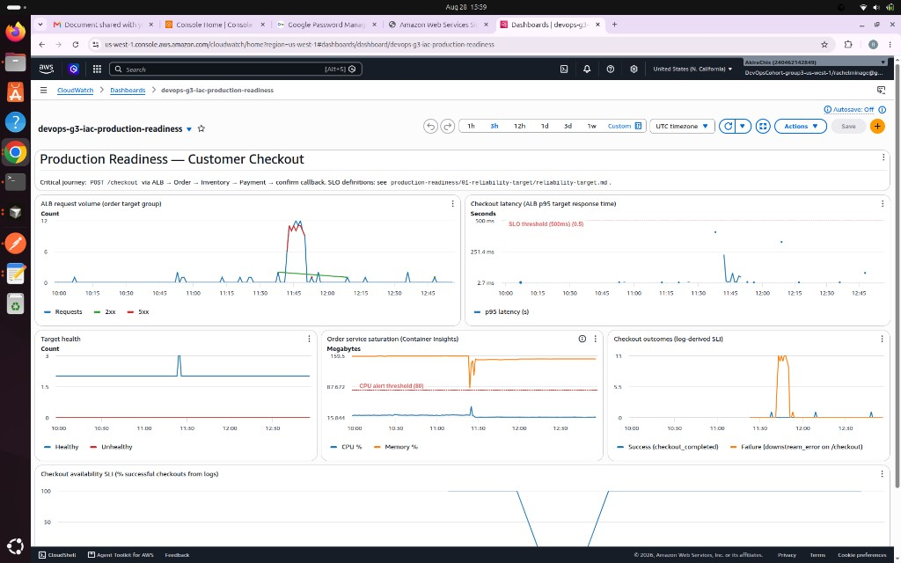

# Incident Timeline - Inventory Outage Drill

**Date:** 2026-08-28 (UTC)  
**Injected failure:** Scale inventory ECS service to zero tasks  
**Critical journey affected:** `POST /checkout`  
**Operator:** Group 3 (controlled production-readiness drill)

---

## Summary

| Metric | Value |
|---|---|
| **Time to Detect (TTD)** | **~3 min 15 sec** (T0 → T2) |
| **Time to Recover (TTR)** | **~17 min 15 sec** (T0 → T6) |
| **Primary alarm** | `devops-g3-iac-pr-checkout-availability-degraded` |
| **Root cause** | Inventory `runningCount = 0` - single-task service with no HA |

---

## Timeline (T0 → T6)

| ID | Time (UTC) | Event | Evidence |
|---|---|---|---|
| **T0** | ~**11:43:00** | Failure injected: `aws ecs update-service … devops-g3-iac-inventory --desired-count 0` | Operator action; ECS desired count 0 |
| **T1** | ~**11:43:18** | First customer impact: probe records `http=502 outcome=failure` | [probe-output.txt](../04-runbook/test-evidence/probe-output.txt) |
| **T1b** | **11:42–11:43** | ALB `HTTPCode_Target_5XX_Count` rises (6 then 11 errors/min) | [cloudwatch-5xx-spike-during-inventory-outage.png](evidence/cloudwatch-5xx-spike-during-inventory-outage.png) |
| **T2** | **11:46:15** | CloudWatch alarm **ALARM**; SNS → Lambda → Slack `#group-3-alerts` | [alarm-history.txt](../04-runbook/test-evidence/alarm-history.txt); [slack-alarm-ok-after-recovery.png](evidence/slack-alarm-ok-after-recovery.png) |
| **T3** | ~**11:46–11:55** | Diagnosis: order logs show `downstream_error`; inventory `runningCount=0`; ALB `/health` still passing | [logs-insights-checkout.png](../01-reliability-target/screenshots/logs-insights-checkout.png) |
| **T4** | ~**11:55–12:00** | Mitigation: scale inventory `--desired-count 1`; wait for task RUNNING | Runbook § Mitigate |
| **T5** | ~**12:00** | Checkout succeeds again; 5xx rate drops; availability SLI recovers toward 100% | [cloudwatch-dashboard-during-recovery.png](evidence/cloudwatch-dashboard-during-recovery.png) |
| **T6** | **12:00:15** | Alarm returns **OK**; Slack `[OK]` notification | [alarm-history.txt](../04-runbook/test-evidence/alarm-history.txt); [cloudwatch-alarms-ok-after-recovery.png](evidence/cloudwatch-alarms-ok-after-recovery.png) |

### TTD / TTR calculation

```
TTD = T2 − T0 = 11:46:15 − 11:43:00 ≈ 3 min 15 sec
TTR = T6 − T0 = 12:00:15 − 11:43:00 ≈ 17 min 15 sec
```

Alarm evaluation requires **2 consecutive 60s periods** with 5xx ≥ 1, which explains ~3 min delay between first 502 (T1) and paging (T2).

---

## SLI impact

From dashboard `devops-g3-iac-production-readiness` during the incident window:

| SLI | During incident | After recovery |
|---|---|---|
| Checkout availability (log-derived) | Dropped to **0%** (~11:45) | Returned to **100%** (~12:00) |
| Checkout outcomes | Spike in `downstream_error` / failure | `checkout_completed` resumes |
| ALB 5xx | Peak ~11–12 errors/min | Near zero |
| Target health | **2 healthy** throughout | Unchanged - order tasks healthy |
| Latency p95 | Brief elevation, below 500 ms SLO | Normal |



---

## Detection gap

**Gap:** ALB target health and `GET /health` stayed **green** while checkout failed.

- Order health check only hits `/health`, which does not call inventory.
- Operators relying on target health alone would miss a downstream-only outage.
- The 5xx alarm required **actual checkout traffic** (probe script) to accumulate errors over 2 minutes.

**Fix before production:**

1. Run synthetic `POST /checkout` probe on an interval (CloudWatch Synthetics or scheduled probe).
2. Alert on log-derived `CheckoutFailure` metric, not only ALB 5xx.
3. Document in runbook: **never trust `/health` alone for checkout readiness**.

---

## Recovery gap

**Gap:** Recovery required **manual** `aws ecs update-service --desired-count 1`.

- No auto-scaling policy restores inventory when scaled to zero.
- Inventory runs **1 task** (`desired_count = 1`) - any task loss is a full outage.
- No runbook automation or ECS Service Auto Scaling on custom metrics.

**Fix before production:**

1. Set inventory `desired_count ≥ 2` for HA.
2. Add ECS Service Auto Scaling on CPU or custom health metric.
3. Codify minimum task count in Terraform with drift detection.
4. Optional: Lambda remediation for known-safe failures (with guardrails).

---

## Evidence index

| File | Description |
|---|---|
| [cloudwatch-5xx-spike-during-inventory-outage.png](evidence/cloudwatch-5xx-spike-during-inventory-outage.png) | 5xx metric + alarm graph during outage |
| [cloudwatch-dashboard-during-recovery.png](evidence/cloudwatch-dashboard-during-recovery.png) | Full SLI dashboard - drop and recovery |
| [cloudwatch-alarms-ok-after-recovery.png](evidence/cloudwatch-alarms-ok-after-recovery.png) | Alarm detail after recovery |
| [slack-alarm-ok-after-recovery.png](evidence/slack-alarm-ok-after-recovery.png) | Slack notifications to `#group-3-alerts` |
| [alarm-history.txt](../04-runbook/test-evidence/alarm-history.txt) | CLI alarm state transitions with timestamps |
| [probe-output.txt](../04-runbook/test-evidence/probe-output.txt) | Probe 502 lines during failure |
| [checkout-success.json](../04-runbook/test-evidence/checkout-success.json) | Post-recovery checkout validation |
